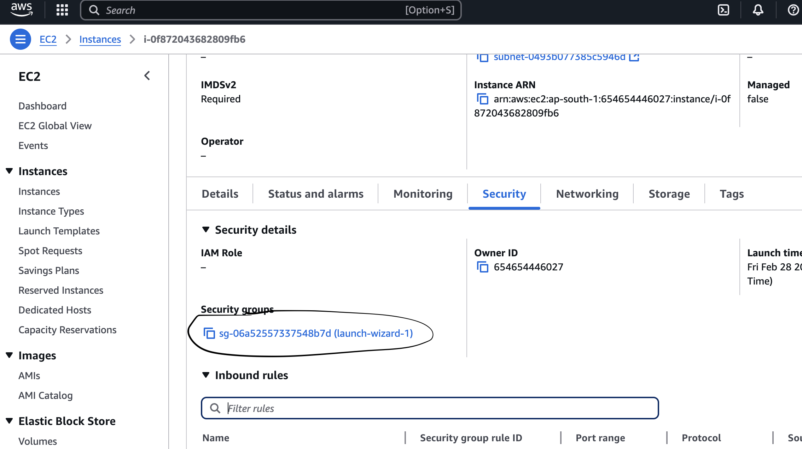
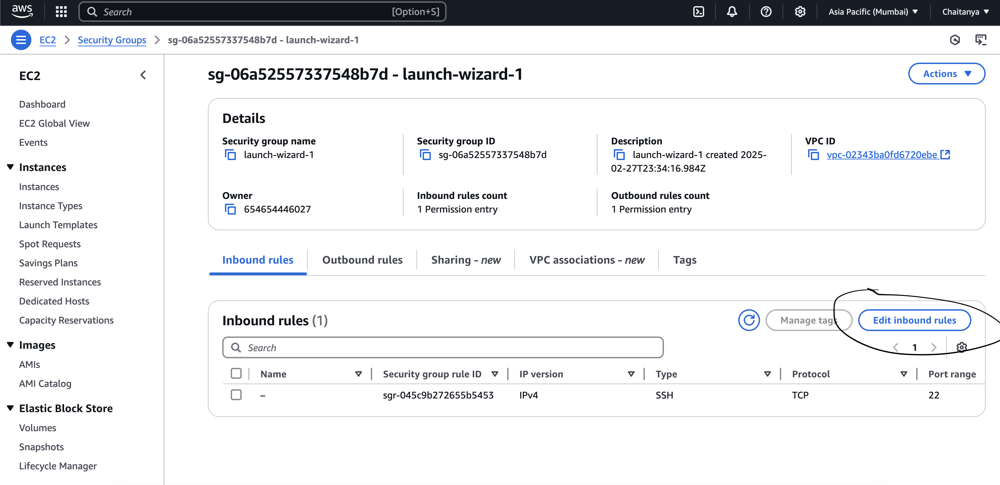
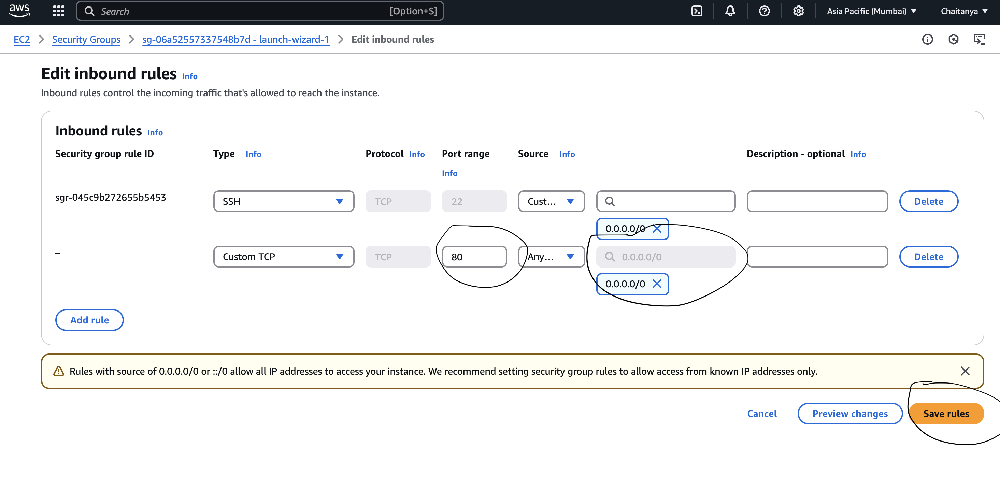
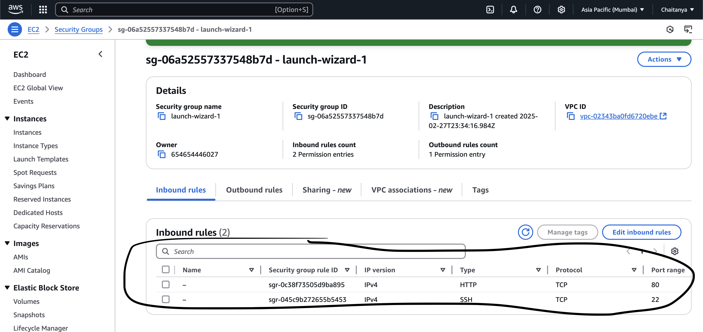
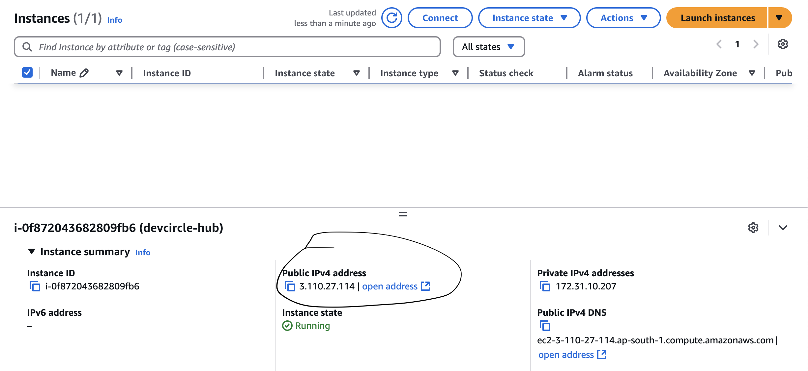
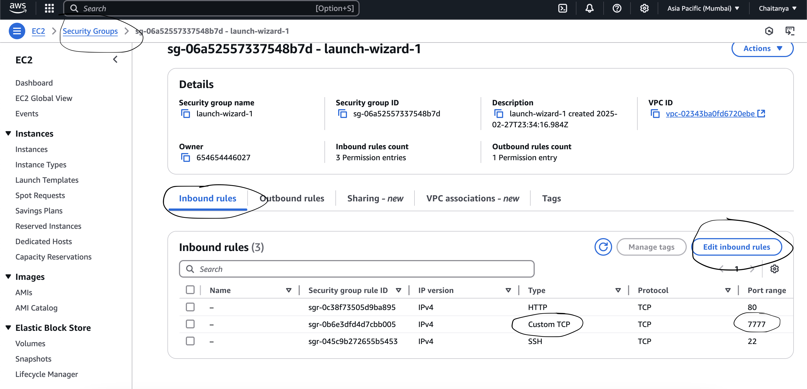

# DevTinder

- Create a Vite + React application
- Remove unecessary code and create a Hello World app
- Install Tailwind CSS
- Install Daisy UI
- Add NavBar component to App.jsx
- Create a NavBar.jsx separate Component file
- Install react router dom
- Create BrowserRouter > Routes > Route=/ Body > RouteChildren
- Create an Outlet in your Body Component
- Create a footer
- Create a Login Page
- Install axios
- CORS - install cors in backend => add middleware to with configurations: orgin, credentials: true
- Whenever you're making API call so pass axios => { withCredentials: true }
- install react-redux + @reduxjs/toolkit - https://redux-toolkit.js.org/tutorials/quick-start
- configureStore => Provider => createSlice => add reducer to store
- Add redux devtools in chrome
- Login and see if your data is coming properly in the store
- NavBar should update as soon as user logs in
- Refactor our code to add constants file + create a components folder
- You should not be access other routes without login
- If token is not present, redirect user to login page
- Logout Feature
- Get the feed and add the feed in th store
- build the user card on feed
- Edit Profile Feature
- Show Toast Message on save of profile
- New Page - See all my connections
- New Page - See all my Conenction REquests
- Feature - Accept/Reject connection request
- Send/Ignore the user card from the feed
- Signup New User
- E2E testing

Also clone the backend code from - https://github.com/ChaitanyaAnnamreddy/devLink-backend

# Production deployment manually (frontend deployment process)

- create a AWS account - https://aws.amazon.com/ (it will ask for credit card details. in the final step select Basic support - Free)
- Then go to aws console -> EC2 -> Launch Instance
- we should create a new EC2 instance or virtual machine
- give a name to your instance
- select the OS - use any OS - i used ubuntu
- scroll down -> select the type of instance - i used t2.micro
- key pair - create a new key pair - name anything - download the public key
- click on launch instance
- wait for the instance to get ready
- connect to your instance
- click on SSH client
- go to terminal or command prompt - go to the folder where the key is downloaded(ex: cd downloads in mycase)
- give the command - chmod 400 <key-file-name>.pem (changing the permision of our secret key)
- give the command - ssh -i <key-file-name>.pem ubuntu@<instance-public-ip> (connecting to our instance using the key) - logging into our machine
- once you are in your ubunto maching - install nodejs ----> curl -o- https://raw.githubusercontent.com/nvm-sh/nvm/v0.40.1/install.sh | bash
- close the terminal and reopen, make sure you are in the folder where your key is present
- Download and install Node.js:
- nvm install 22(this version should match your local node version)
- check
  - node -v,
  - npm -v
- Then clone the frontend code - git clone https://github.com/ChaitanyaAnnamreddy/DevLink.git
- similarly clone the backend code - git clone https://github.com/ChaitanyaAnnamreddy/devLink-backend.git
- then run command ls - you should see two folders - DevLink and devLink-backend
- in your local make sure your frontend code is build - npm run build
- cd into DevLink
  - npm install
  - npm run build
  - run command ls and you should see the file - dist
  - run sudo apt update - this will update the package list
  - run sudo apt install nginx - this will install nginx
  - run sudo systemctl start nginx - this will start the nginx on to our system
  - run sudo systemctl enable nginx - this will enable the nginx on to our system
  - copy code from dist folder(build files) to /var/www/html - run sudo scp -r dist/\* /var/www/html
  - run cd /var/www/html - all the built files are now present in the html folder
-  - now go to aws instance and click on security group
-  - click edit inbound rules - then click add rule
-  - in port range give 80 and source as 0.0.0.0/0 - click save rules
-  - you should be able to see port range 80
-  - copy the public ip and paste it in the browser - you should see the frontend running

# Production deployment manually (backend deployment process)

- cd devLink-backend(make sure you have latest changes. if not run git pull)
- npm install
-  - in EC2 instance click on security group - inbound rules - add rule - port range 7777 and source as 0.0.0.0/0 - click save rules( we are allowing port 7777 and whitelist our ip)
- npm install pm2 -g(process manager to keep application running 24/7)
- pm2 logs - to check errors
- pm2 list - list all the applications
- pm2 flush <name of the application> - in my case its pm2 npm
- custom name of the application - run pm2 start npm --name "devlink" -- start(in the background it will run npm start)
- pm2 stop <name of the application> - stop the application
- pm2 delete <name of the application> - delete the application
- copy the public ip and paste it in the browser - you should see the backend running - ex: http://3.110.27.114:7777/feed( i am running feed api)

# merging both the frontend and backend so the application will run

- frontend ip - http://3.110.27.114
- backend ip - http://3.110.27.114:7777 but we don't want backend to run on :7777 so will use npinx to propy path it to /api
- Step 1: Install NGINX (if not installed)
  - Run the following command to install NGINX on your Ubuntu AWS machine:
    - sudo apt update && sudo apt install nginx -y
- Step 2: Configure NGINX

  - Open the NGINX configuration file for your site:
    - sudo nano /etc/nginx/sites-available/default
  - Replace the existing server block with the following:

    server {
    listen 80;
    server_name 3.110.27.114;

    location /api/ {
    proxy_pass http://localhost:7777/; # Proxy to your Node.js app
    proxy_http_version 1.1;
    proxy_set_header Upgrade $http_upgrade;
    proxy_set_header Connection 'upgrade';
    proxy_set_header Host $host;
    proxy_cache_bypass $http_upgrade;
    proxy_set_header X-Real-IP $remote_addr;
    proxy_set_header X-Forwarded-For $proxy_add_x_forwarded_for;
    proxy_set_header X-Forwarded-Proto $scheme;
    }
    }

- Step 3: Enable Configuration & Restart NGINX
  Save the file (CTRL + X, then Y, then Enter)

  - sudo nginx -t # Test the configuration
    If there are no errors, restart NGINX:
  - sudo systemctl restart nginx

- finally modify the frontend BASE_URL to /api
